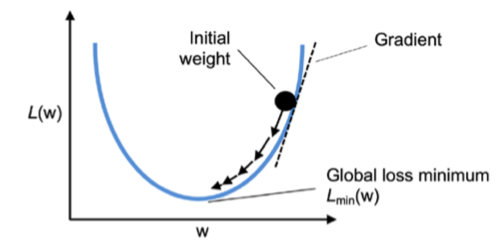
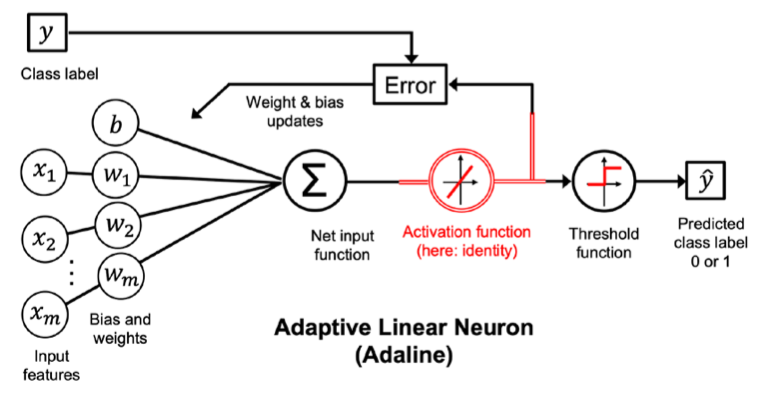

## Notes

### Minimize loss functions with gradient descent

We define the loss function, L, to learn the model parameters as the mean squared error (MSE) between the calculated outcome and the true class label:

$$L(w, b) = \frac{1}{N} \sum_{i=1}^{N} (y_i - (wx_i + b))^2$$

where `$y_i$` is the true class label and `$wx_i + b$` is the calculated outcome.

The term `$\frac{1}{2}$` is just added for our convenience and will make it easier to derive the gradient of the loss function with respect to the weight parameters.

If you are familiar with calculus, the partial derivative of the MSE loss function with respect to the jth weight can be obtained as follows:

$$\frac{\partial L}{\partial w_j} = \frac{\partial}{\partial w_j} \frac{1}{N} \sum_{i=1}^{N} (y_i - (wx_i + b))^2$$    

$$= \frac{1}{N}\frac{\partial}{\partial w_j} \sum_{i=1}^{N} (y_i - (wx_i + b))^2$$    

$$= \frac{2}{N}\sum_{i=1}^{N} (y_i - (wx_i + b)) \frac{\partial}{\partial w_j} (y_i - (wx_i + b))$$    

$$= \frac{2}{N}\sum_{i=1}^{N} (y_i - (wx_i + b))(-x_{ij})$$    

$$= -\frac{2}{N}\sum_{i=1}^{N} (y_i - (wx_i + b))x_{ij}$$    

### ADAptive LInear NEuron classifier

The ADAptive LInear NEuron (ADALINE) is a single-layer perceptron that uses the linear activation function. It is also known as the single-layer perceptron with linear output.

