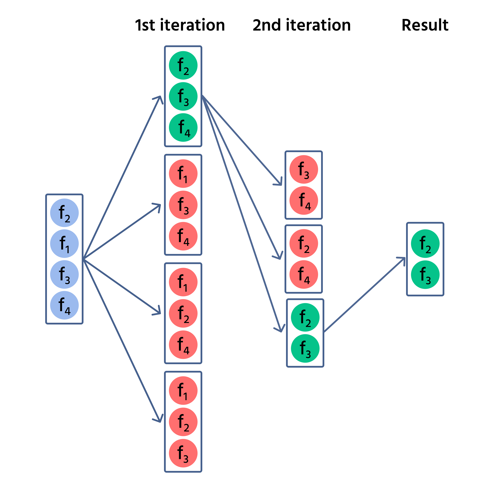

### Data Processing
#### Select meaningful features

##### Sequential backward selection (SBS)
Sequential backward selection (SBS) is a feature selection algorithm that iteratively removes features from the dataset until a desired number of features is reached. It is a greedy algorithm that works by iteratively removing the least important feature until a desired number of features is reached.

**Step-by-Step Process of SBS Algorithm**

1. Start with All Features
2. Define Evaluation Metric: define an evaluation metric to measure the quality of a subset of features
3. Iterative Elimination
   - Remove One Element: each feature is removed one at a time, creating multiple subsets. For each subset with one less feature, evaluate the subset's performance using the defined metric;
   - Evaluate Subsets: calculate the evaluation metric for each subset to determine which removal has the least impact on performance
   - Select Optimal Subset: identify and keep the subset that has the highest performance.
4. Repeat Until Desired Number of Features is Reached: SBS continues iterating until the number of remaining features reaches the specified minimum subset size.

{width=350}

#### FAQs:
- When should I use SBS over SFS?
  - Answer: SBS is preferable when you start with a large set of features and need to eliminate the irrelevant ones. SFS is ideal when building a feature set from scratch.

- Are SBS and SFS prone to overfitting?
  - Answer: These methods can reduce overfitting by eliminating irrelevant features. However, careful cross-validation is still necessary to avoid overfitting.

- How do these methods compare with other feature selection techniques?
  - Answer: Sequential Forward Selection (SFS) and Sequential Backward Selection (SBS) offer a model-driven approach that captures feature interactions, unlike filter methods which assess features individually. However, SFS and SBS are slower than embedded methods like Lasso and may struggle with high-dimensional data due to their iterative and computationally intensive nature.