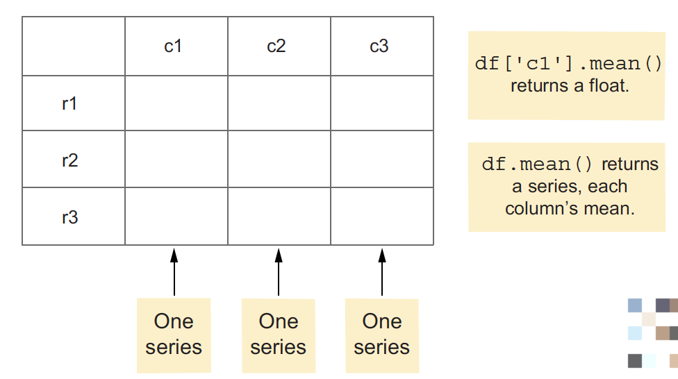
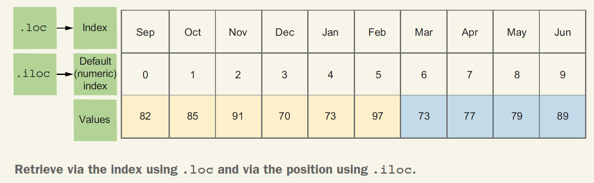

# Series

Two-dimensional tables known as data frames, with rows and columns. But each
column in a data frame is built from a series.



Invoking a series method (such as mean) on a data frame often returns one value for each column.
If you invoke mean on a data frame, pandas invokes the mean method on each column, returning a collection of mean values.


### Notes:

#### Predictable random numbers
- The Python standard library’s `random` module has a `randint` method that returns a random integer:

```python
import random
random.randint(0, 100)
```
In the case of `random.randint`, the returned values range from 0 to 100, including 100.

- In the world of NumPy, though, we do things differently. First, we create a new random number generator object:

```python
import numpy as np
g = np.random.default_rng()
```
we can create an array of random integers by invoking `g.integers`:

```python
g.integers(0, 100, 10)
```

This method differs from Python’s `random.randint` function in the following ways:
- It returns a NumPy array rather than a single integer.
- It takes three arguments: the minimum value, the maximum value, and the
length of the array that should be returned.
- The second argument is one more than the highest value we can get back.

We can pass a random seed: a number that kicks off the random-number generator when we invoke `np.random.default_rng`. If you and I pass the same argument to `default_rng`, we will see the same sequence of random numbers.

#### loc vs. iloc vs. head

- Prefer to use `.loc`, which is more readable and easier to understand.
- Plus, `.loc` offers a great deal of flexibility and power when working with data
frames.



- the first five: `s.head()`
- the last five: `s.tail()`

#### Understanding mean and standard deviation
Pandas lets us calculate the mean on a series with `s.mean()` and the standard deviation with `s.std()`.

The mean describes the center of a data set. In pandas syntax, we can say that `s.mean()` is the same as `s.sum() / s.count()` because `s.sum()` adds the values and `s.count()` tells us how many non-NaN values are in the series.

But the mean is flawed because a single large value can skew it. A common alternative is the median, which is the value precisely halfway from the smallest to the largest value.

Whether we’re using the mean or the median to find the central point in our data set,we will almost certainly want to know the standard deviation: a measurement of how much the values in our data set vary from one another.

To calculate the standard deviation on series `s`, we do the following:
- Calculate the difference between each value in `s` and its mean.
- Square each of these values.
- Sum the squares.
- Divide by the number of elements in `s`. This is known as the variance.
- Take the square root of the variance, which gives us the standard deviation.

```python
import math
math.sqrt(((s - s.mean()) ** 2).sum() / s.count())
```

Given our values of s from before, this results in a value of 8.380930735902785. If we then calculate s.std(), we get . . . uh, oh. We get a different value, 8.83427667918797. What’s going on?

By default, pandas assumes that we don’t want to divide by `s.count()` but rather by `s.count() - 1`. This is known as the sample standard deviation and is typically used on a sample of the data rather than the entire population.

If you want to get the same result that we calculated and that NumPy provides, you can pass a value of `0` to the `ddof` (delta degrees of freedom) parameter: `s.std(ddof=0)`


#### Understanding dtype
Use the built-in core data types: `int`, `float`, `str`, `list`, `tuple`, and `dict`.

The core NumPy `dtype` values to know are as follows:
- Integers of different sizes—`np.int8`, `np.int16`, `np.int32`, and `np.int64`.
- Unsigned integers of different sizes—`np.uint8`, `np.uint16`, `np.uint32`, and `np.uint64`.
- Floats of different sizes—`np.float16`, `np.float32`, and `np.float64`. (On some computers, you also have `np.float128`.)
- Python objects—`object`.

When you create a series, pandas normally assigns the `dtype` based on the argument you pass to `Series`:
- If all values are integers, the `dtype` is set to `np.int64`.
- If at least one of the values is a float (including NaN), the `dtype` is set to `np.float64`.
- Otherwise, the `dtype` is set to `object`.


#### Selecting values with booleans

- A boolean index or a mask index.
- Mask indexes are useful and powerful, but their syntax can take some getting used
to. First, consider that we can retrieve any element of a series via square brackets
and an index:

```python
s = Series([10, 20, 30, 40, 50])
s.loc[3] # 40
```

1. Instead of passing a single integer, we can also pass a list (or NumPy array, or series) of boolean values (i.e., True and False):

```python
s.loc[[True, True, False, False, True]] # Series([10, 20, 50])
```

Notice the double square brackets! The outer pair indicates we want to retrieve from s. The inner pair defines a Python list. Returns a series containing 10, 20, and 50.

- Wherever we pass True, the value from s is returned, and wherever we pass False, the value is ignored. This is called a mask index because we’re using the list of booleans as a type of sieve, or mask, to select only certain elements. Mask indexes don’t transform the data but rather select specific elements from it.

2. We can also use a series of booleans:

```python
s.loc[s < 30] # Series([10, 20])
```

3. Given a series s, you can retrieve multiple items from different indexes using fancy indexing: passing a list, series, or similar iterable inside the square brackets.
For example:

```python
s.loc[[2,4]]  # This code returns a series containing two values: the elements at s.loc[2] and s.loc[4].
```


