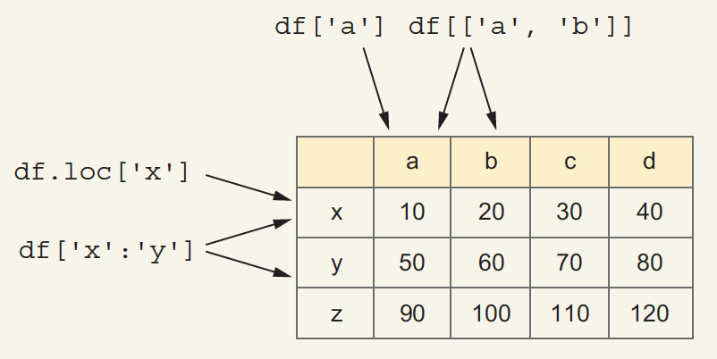
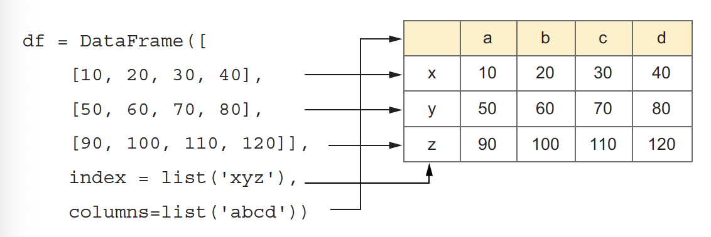
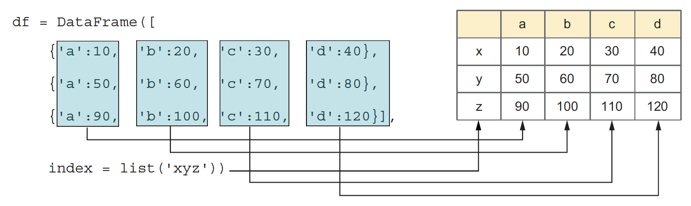
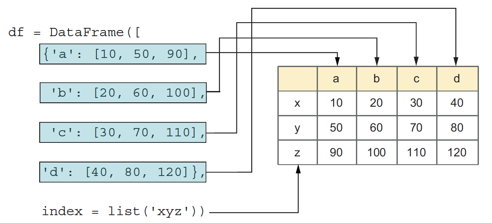
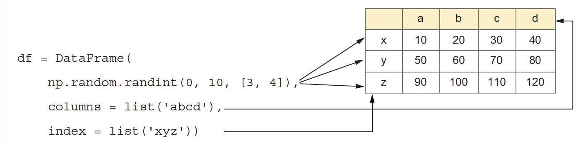
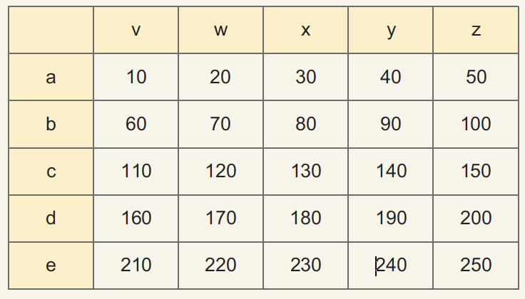
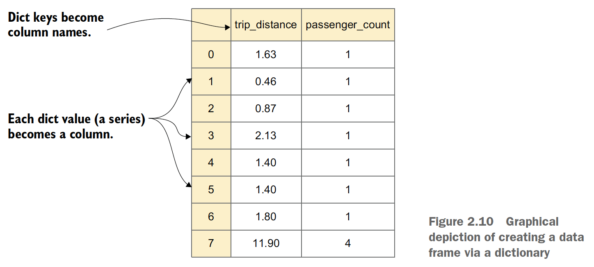

## DataFrames
A DataFrame is a table of data with rows and columns.

- When we’re working with a series, we can retrieve values several ways: using the `index` (and `loc`), using the position (and `iloc`), and using square brackets, which are equivalent to `loc` for simple cases. 
- When we work with data frames, though, we must use `loc` or `iloc` to retrieve rows.



Given this data frame and the fact that square brackets refer to columns, we can understand how `df['a']` returns the a column; and `df[['a', 'b']]`, passing a list of columns inside the square brackets (that is, double square brackets), returns a new, two-column data frame based on df. 

If we ask for `df['x']`, pandas will look for a column x, not see one, and raise a `KeyError` exception. To retrieve the row at index x, we must say `df.loc['x']` or, if we prefer to retrieve it positionally, `df.iloc[0]`.

Notes:
- This means we can retrieve rows from `x` through `y` with `df['x':'y']`. The slice tells pandas to use the rows rather than the columns.
- Another way to work with columns is to use dot notation. That is, if you want to retrieve the column `colname` from data frame `df`, you can say `df.colname`.

#### Creating a DataFrame

- Pass a list of lists. Each inner list represents one row. The inner lists
must all be the same length and fill the columns positionally.



- Pass a list of dictionaries. Each dict represents one row, and
the keys indicate which columns should be filled.




- Pass a dict of lists. Each key represents one column, and the values (lists) are each column’s values.



- Pass a two-dimensional NumPy array.




#### Adding columns with assign
Another way to add a column to a pandas data frame is the assign method, which returns a new data frame rather than modifying an existing one.

```python
df['current_net'] = ((df['retail_price'] - df['wholesale_price']) * df['sales'])
```

```python
df.assign(
    current_net = (df['retail_price'] - df['wholesale_price']) * df['sales']
)
```

#### Retrieving and assigning with loc
What if we want to retrieve only part of a row? More significantly, how can we set values on only part of a row?

- We can do this several ways, but I prefer loc, with two arguments in square brackets. The first argument describes the row(s) we want to retrieve (row selector), and the second describes the column(s) we want to retrieve (column selector).

Let’s assume we have a 5x5 data frame with index a-e, columns v-z, and values from 10 through 250. To retrieve row a, we can say `df.loc['a']`. But to retrieve the item at index a in column x, we can say `df.loc['a', 'x']`.




```python
df.loc[['a', 'c'],  # row selector
        'x']  # column selector

df.loc[['a', 'c'],  # row selector
        ['v','y']]     # column selector

df.loc[df['x']>200]  # row selector

df.loc[df['x']>200, df.loc['c'] > 135] # row and column selector
```

#### pd.concat
With this new data frame in hand, we want to add it to the previously existing one. The result of `pd.concat` is a new data frame.

```python
pd.concat([df, df2])
```

#### Getting answers with the query method

- Using a traditional boolean index

```python
df[df['x'] > 200]
```

- Using the query method

```python
df.query('x > 200')
```

- Using the query method with a string

```python
df.query('v > 300 & w % 2 == 1') # & is used for "and" in the query string.

df.query('(v > 300) & (w % 2 == 1)')
```

#### Create the data frame based on two separate series

```python
trip_distance = pd.read_csv('data/taxi-distance.csv', header=None).squeeze()

passenger_count = pd.read_csv('data/taxi-passenger-count.csv', header=None).squeeze()
```
How can we turn these series into a data frame?
The easiest technique is to create the data frame as a dict in which the keys are strings naming the columns and the values are the series themselves.



Creating the data frame:

```python
df = DataFrame({'trip_distance': trip_distance, 
                'passenger_count': passenger_count})
```

#### df.interpolate()

Python Pandas interpolate() method is used to fill NaN values in the DataFrame or Series using various interpolation techniques to fill the missing values rather than hard-coding the value.
- 如果你的数据有缺失（比如某些单元格是 NaN），interpolate() 会用 合理的估算值 填充这些空缺。
- 它默认使用 线性插值（假设数据是均匀变化的），但也可以选择其他方法（如多项式、时间序列插值）。

```python
# 用 "polynomial"（多项式插值）
df.interpolate(method='polynomial', order=2)

# 用 "time"（时间序列插值，适合时间索引数据）
df.interpolate(method='time')
```

- method=	适用场景:
  - 'linear'（默认）	数值均匀变化时
  - 'polynomial'	数据呈曲线趋势时
  - 'time'	数据是时间序列（如股票价格）
  - 'nearest'	用最近的非 NaN 值填充

- axis 参数决定按行还是列填充：
  -  按列填充（默认）`df.interpolate(axis=0)`  
  -  按行填充 `df.interpolate(axis=1)`  

**什么时候用 interpolate()？**
- 数据缺失较少，且缺失值周围有规律（如时间序列、温度变化等）。
- 不想直接删除含 NaN 的行（`df.dropna()`）。


