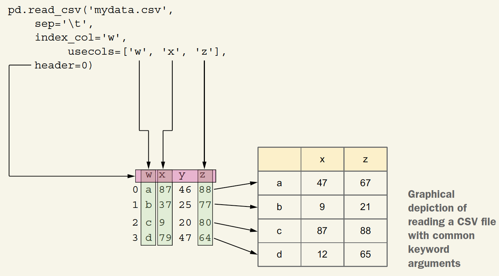

# Import and Export Data

- `pd.read_csv` Returns a new data frame based on CSV input
```python
df = pd.read_csv('myfile.csv')
```

- `df.to_csv` Writes the data frame to a CSV file
```python
df.to_csv('myfile.csv')
```

- `pd.read_json` Returns a new data frame based on JSON input
```python
df = pd.read_json('myfile.json')
```

- `df.corr` Shows the correlations among the columns
```python
df.corr()
```

- `df.dropna` Returns a new data frame without any NaN values
```python
df.dropna()
```

- `df.loc` Retrieves selected rows and columns
```python
df.loc[0, 'name']
```

- `pd.read_html` Returns a list of data frames based on HTML input
```python
df = pd.read_html('myfile.html')
```

- `s.value_counts` Returns a sorted (descending frequency) series counting how many times each value appears in s
```python
s.value_counts()
```

- `s.round` Returns a new series based on s in which the values are rounded to the specified number of decimals.
```python
s.round(2)
```

- `pd.Series.idxmin` Returns the index of the lowest value in a series
```python
s.idxmin()
```

- `pd.Series.idxmax` Returns the index of the highest value in a series
```python
s.idxmax()
```

- `pd.DataFrame.agg` Invokes one or more aggregation methods on a data frame
```python
df.agg('mean')
```

For example,



```python
pd.read_csv('mydata.csv',   # Names the CSV file to read
            sep='\t',       # Uses a tab as a separator character
            index_col='w',  # Uses the column 'w' as the index
            usecols=['w', 'x', 'z'],  # Uses only the columns 'w', 'x', and 'z'
            header=0)  # Uses the first row as the header
```


#### df.dropna() 
which returns a new data frame identical to `df` except that all rows with NaN values are dropped.


