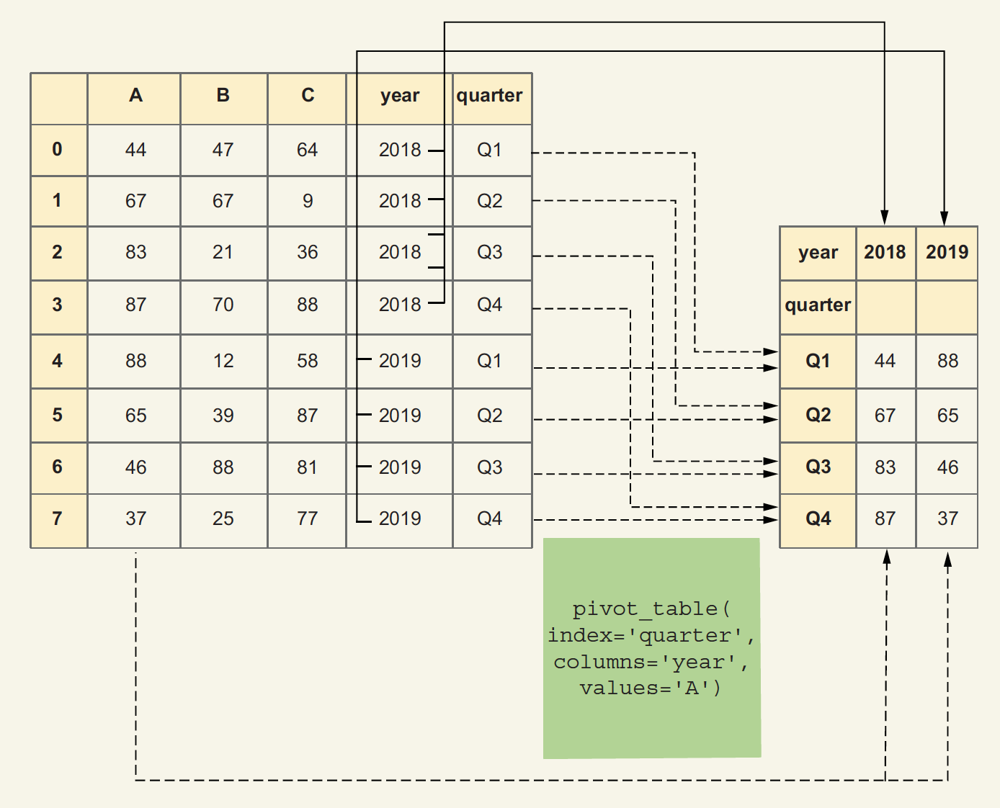

# Indexes

We can combine multiple columns into a hierarchical `multi-index` and then perform searches on specific parts of that hierarchy. Indeed, knowing how to create, query, and manipulate multi-indexed data frames is key to fluent work with pandas.

We can also create pivot tables in which the rows and columns reflect not our original data, but rather aggregate summaries of that data.

### use pandas indexes to retrieve data

- `pd.set_index` Returns a new data frame with a new index

```python
df = df.set_index('w')
```

- `pd.reset_index` Returns a new data frame with a default (numeric, positional) index

```python
df = df.reset_index()
```

- `df.loc` Retrieves selected rows and columns

```python
df.loc[0, 'name']
```

- `s.value_counts` Returns a sorted (descending frequency) series counting how many times each value appears in s

```python
s.value_counts()
```

- `s.isin` Returns a boolean series indicating whether a value in s is an element of the argument

```python
s.isin(['a', 'b', 'c'])
```

- `df.pivot` Creates a pivot table based on a data frame without aggregation

```python
df.pivot(index='w', columns='x', values='y')
```

- `df.pivot_table` Creates a pivot table based on a data frame, with aggregation, if needed

```python
df.pivot_table(index='w', columns='x', values='y')
```

- `s.is_monotonic_increasing` Contains True if values in the series are sorted in increasing order

```python
s.is_monotonic_increasing
```

- slice Python builtin for creating slices

```python
slice[0:3]
```

- `df.xs` Returns a cross-section from a data frame

```python
df.xs(2016, level='Year')
```

- `df.dropna` Returns a new data frame without any NaN values

```python
df.dropna()
```

#### Sorting by index
Pandas also lets us sort data frames based on the index. We can do that with the `sort_index` method, which (like so many others) returns a new data frame with the same content as the original, with rows sorted based on the index’s values.

```python
df = df.sort_index()
```

#### Pivot tables

`df.pivot_table()` is the core function for **pivot tables** in Pandas. It allows us to reshape and aggregate data from a data frame, enabling multi-dimensional statistical analysis.
- `df.pivot_table()` 是 Pandas 中用于**数据透视表Pivot Table**的核心函数，它通过分组、聚合和重塑数据，实现多维度的统计分析。



```python
df.pivot_table(index='quarter', 
               columns='year', 
               values='A', 
               sort=False, 
               aggfunc='size')
```

**When Should You Use df.pivot_table?**
- Group data by one or more columns and compute statistics (e.g., mean, sum, count).
- Summarize data across multiple dimensions (rows + columns).
- Aggregate duplicate values automatically.


# pivot_table vs. groupby

| Method      | Best For                                      | Output                                  |
|-------------|----------------------------------------------|-----------------------------------------|
| groupby     | Simple grouping (single or multiple columns) | Returns a Series or DataFrame           |
| pivot_table | Multi-dimensional summaries (rows + columns) | Returns a structured table (like Excel) |


