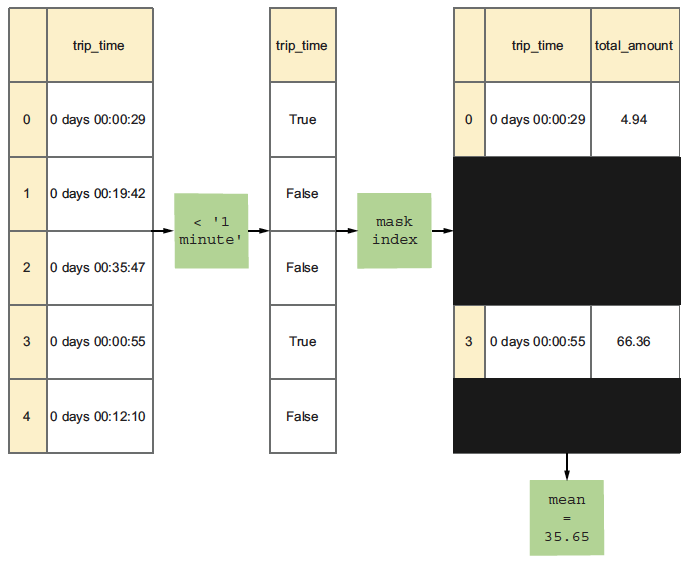

## Date and Time

### Methods for creating dates and times

- `pd.to_timedelta()`: convert strings to timedelta objects

```python
pd.to_timedelta('1 days 2 hours 30 minutes')

# output: 1 days 02:30:00

time_list = ['0 days', '10 minutes', '1 hour']
s = pd.to_timedelta(time_list)

# output: 
# 0   0 days 00:00:00
# 1   0 days 00:10:00
# 2   0 days 01:00:00
# dtype: timedelta64[ns]
```

- `pd.to_datetime()`: If passed a series of strings, returns a series of Timestamp objects
  
```python
pd.to_datetime('2019-07-01 12:00:00')

# output: Timestamp('2019-07-01 12:00:00')
```

- `time.strftime(a_time, a_format)`: Produces a string based on a time value

```python
a_time = pd.Timestamp('2019-07-01 12:00:00')
a_format = '%Y-%m-%d %H:%M:%S'

print(time.strftime(a_time, a_format))  

# output: 2019-07-01 12:00:00
```

- `time.strptime(time_string, format)`: Parses a string into a time object

```python
time_string = '2019-07-01 12:00:00'
format = '%Y-%m-%d %H:%M:%S'

print(time.strptime(time_string, format))

# output: time.struct_time(tm_year=2019, tm_mon=7, tm_mday=1, tm_hour=12, tm_min=0, tm_sec=0, tm_wday=0, tm_yday=182, tm_isdst=-1)
```

```python
s = Series(['1970-07-14 8:00', '1972-03-01 10:00 pm',
'2000-12-16 12:15:28', '2002-12-17 18:17', '2005-10-31 23:51'])
pd.to_datetime(s)

# output: 
# 0   1970-07-14 08:00:00
# 1   1972-03-01 22:00:00
# 2   2000-12-16 12:15:28
# 3   2002-12-17 18:17:00
# 4   2005-10-31 23:51:00
# dtype: datetime64[ns]
```


