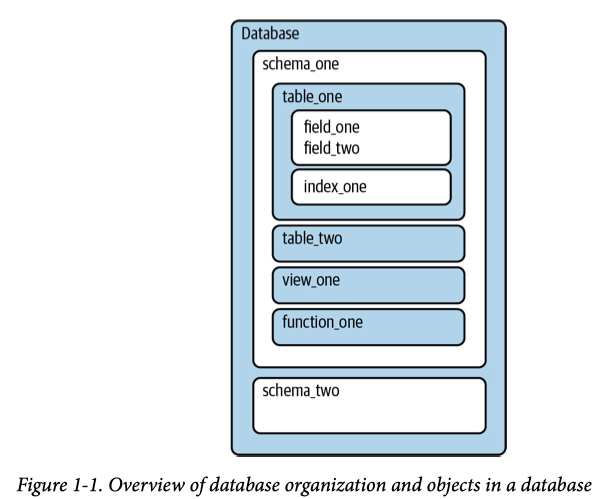
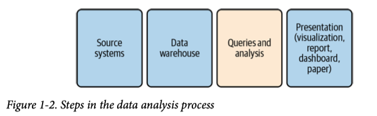

## SQL

SQL is the language used to communicate with databases. (Structured Query Language)

To communicate with databases, SQL has four sublanguages for tackling different jobs, and these are mostly standard across database types.

- DDL (Data Definition Language)
  - There are three common commands: CREATE, ALTER, and DROP.
- DML (Data Manipulation Language)
  - The commands are INSERT, UPDATE, and DELETE.
- DQL (Data Query Language)
  - DQL commands include SELECT
- DCL (Data Control Language)
  - Commands include GRANT and REVOKE, which give permission and remove permission, respectively.

One major difference between SQL and other coding languages is where the code runs and, therefore, how much computing power is available. SQL always runs on a database server, taking advantage of all its computing resources.

A second difference is in how data is stored and organized. Relational databases always organize data into rows and columns within tables, so SQL assumes this structure for every query.

Looping is another major difference between SQL and most other computer programming languages. A loop is an instruction or a set of instructions that repeats until a specified condition is met. SQL aggregations implicitly loop over the set of data, without any additional code.

A drawback of SQL is that your data must be in a database, 1 whereas R and Python can import data from files stored locally or can access files stored on servers or websites.

#### When deciding whether to use SQL, R, or Python for an analysis, consider:

- Where is the data located—in a database, a file, a website?
- What is the volume of data?
- Where is the data going—into a report, a visualization, a statistical analysis?
- Will it need to be updated or refreshed with new data? How often?
- What does your team or organization use, and how important is it to conform to existing standards?

#### SQL as Part of the Data Analysis Workflow

The figure 1-2 shows the steps in the process. Queries and analysis are the focus of this book, though I will discuss the other steps briefly in order to put the queries and analysis stage into a broader context.