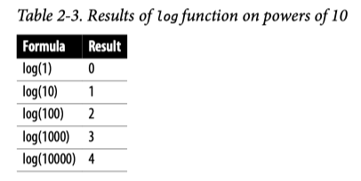
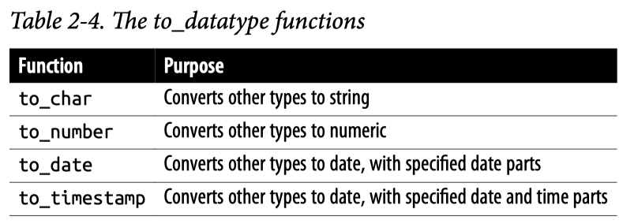
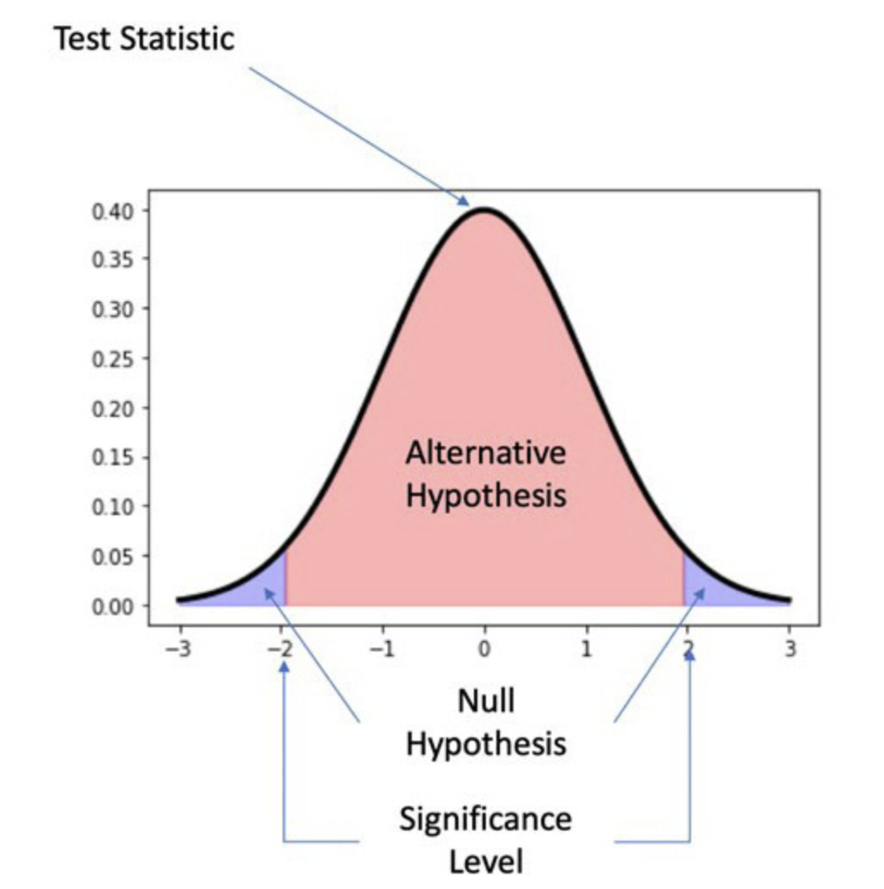

### SQL Query Structure

- The `SELECT` clause determines the columns that will be returned by the query.

- The `FROM` clause determines the tables from which the expressions in the `SELECT` clause are derived.

- The `WHERE` clause specifies restrictions or filters that are needed to exclude or remove rows from the result set. `WHERE` is optional.

- The `GROUP BY` clause is required when the `SELECT` clause contains aggregations and at least one nonaggregated field.


## Data Profiling: Distributions
Profiling is the first thing I do when I start working with any new data set. I look at how the data is arranged into schemas and tables.

Profiling data is related to the concept of exploratory data analysis, or EDA.

After checking a few samples of data, I start looking at distributions. Distributions allow me to understand the range of values that exist in the data and how often they occur, whether there are nulls, and whether negative values exist alongside positive ones. Distributions can be created with continuous or categorical data and are also called frequencies.

**Histograms and Frequencies**
- Frequency checks are also useful whenever you have a question about whether certain values are possible or if you spot an unexpected value and want to know how commonly it occurs. 
- Frequency queries are a great way to detect sparse data as well.

```sql
SELECT 
    fruit,
    count(*) as quantity
FROM 
    table_name
GROUP BY column_name;
```

Example: give a hypothetical table called orders, which has a date, customer identifier, order identifier, and an amount, and then ask to write a SQL query that returns the distribution of orders per customer.

- First, count the number of orders placed by each customer_id in the subquery. The outer query uses the number of orders as a category and counts the number of customers:

```sql
SELECT orders, count(*) as num_customers
FROM
(
    SELECT customer_id, count(order_id) as orders
    FROM orders
    GROUP BY 1
) a
GROUP BY 1;
```

**Binning**

Binning is useful when working with continuous values. Rather than the number of observations or records for each value being counted, ranges of values are grouped together, and these groups are called bins or buckets.

1. A **CASE statement** allows for conditional logic to be evaluated.

   - The WHEN condition can be an equality, inequality, or other logical condition. The THEN return value can be a constant, an expression, or a field in the table.

   - CASE statements can also be nested so that the return value is another CASE statement.

2. **Logarithms** are another way to create bins, particularly in data sets in which the largest values are orders of magnitude greater than the smallest values.

To refresh your memory, a logarithm is the exponent to which 10 must be raised to produce that number:



**n-Tiles**

You’re probably familiar with the median, or middle value, of a data set. This is the 50th percentile value. Half of the values are larger than the median, and the other half are smaller. With quartiles, we fill in the 25th and 75th percentile values. A quarter of the values are smaller and three quarters are larger for the 25th percentile; three quarters are smaller and one quarter are larger at the 75th percentile.

- They take an argument that specifies the number of bins to split the data into and, optionally, a `PARTITION BY` and/or an `ORDER BY` clause:

```sql
ntile(num_bins) over (partition by... order by...)
    
```

- A related function is percent_rank. Instead of returning the bins that the data falls into, percent_rank returns the percentile.

```sql
percent_rank() over (partition by... order by...)
```

## Data Profiling: Data Quality
Data quality is absolutely critical when it comes to creating good analysis.
Profiling is a way to uncover data quality issues early on, before they negatively impact results and conclusions drawn from the data. Profiling reveals nulls, categorical codings that need to be deciphered, fields with multiple values that need to be parsed, and unusual datetime formats.

**Detecting Duplicates**

- One way is to inspect a sample, with all columns ordered:

```sql
SELECT *
FROM table_name
ORDER BY 1, 2, 3  
```

- A more systematic way to find duplicates is to SELECT the columns and then count the rows

```sql
SELECT count(*)
FROM (
    SELECT column_a, column_b, column_c, count(*) as records
    FROM table_name
    GROUP BY 1, 2, 3
) a
WHERE records > 1;
```

**Deduplication with GROUP BY and DISTINCT**
Duplicates happen, and they’re not always a result of bad data. For example, imagine we want to find a list of all the customers who have successfully completed a transaction so we can send them a coupon for their next order.
We might `JOIN` the customers table to the transactions table, which would restrict the records returned to only those customers that appear in the transactions table:

```sql
SELECT a.customer_id, a.customer_name, a.customer_email 
FROM customers a 
JOIN transactions b on a.customer_id = b.customer_id
```

This will return a row for each customer for each transaction, however, and there are hopefully at least a few customers who have transacted more than once. We have accidentally created duplicates, not because there is any underlying data quality problem but because we haven’t taken care to avoid duplication in the results.

- One way to remove duplicates is to use the keyword `DISTINCT`:

```sql
SELECT distinct a.customer_id, a.customer_name, a.customer_email
FROM customers a
JOIN transactions b on a.customer_id = b.customer_id;
```

- Another way to remove duplicates is to use the `GROUP BY` clause:

```sql
SELECT a.customer_id, a.customer_name, a.customer_email 
FROM customers a 
JOIN transactions b on a.customer_id = b.customer_id 
GROUP BY 1,2,3;
```

## Preparing: Data Cleaning
Profiling often reveals where changes can make the data more useful for analysis. Some of the steps are CASE transformations, adjusting for null, and changing data types.

#### Cleaning Data with CASE Transformations
CASE statements can be used to perform a variety of cleaning, enrichment, and summarization tasks.

Nonstandard values occur for a variety of reasons. Values might come from different systems with slightly different lists of choices, options might have been presented to the customer in different languages, or the customer might have been able to fill out the value rather than pick from a list.

Imagine a field containing information about the gender of a person. Values indicating a female person exist as “F,” “female,” and “femme.” We can standardize the values like this:

```sql
CASE when gender = 'F' then 'Female'
     when gender = 'female' then 'Female' 
     when gender = 'femme' then 'Female' 
     else gender 
end as gender_cleaned
```

Listing out all the values with an IN list is also an option. The IN operator allows you to specify a list of items rather than having to write an equality for each one separately. It is useful when the input isn’t continuous or when values in order shouldn’t be grouped together:

```sql
case when likelihood in (0,1,2,3,4,5,6) then 'Detractor' 
     when likelihood in (7,8) then 'Passive' 
     when likelihood in (9,10) then 'Promoter' 
end as response_type
```

- Another useful thing you can do with CASE statements is to **create flags indicating whether a certain value is present, without returning the actual value**. Another use for flagging is during preparation of a data set for statistical analysis. In this case, a flag is also known as a dummy variable, taking a value of 0 or 1 and indicating the presence or absence of some qualitative variable.

```sql
SELECT customer_id ,
case when gender = 'F' then 1 else 0 end as is_female ,
case when likelihood in (9,10) then 1 else 0 end as is_promoter
FROM table_name;
```

`END AS` 是 SQL 中 CASE WHEN 语句的结束部分，用于给计算出的新列命名

You can flatten the data with a CASE statement wrapped in an aggregate and turn it into a flag at the same time by using 1 and 0 as the return value. Here, 1 is substituted for TRUE and 0 is substituted for FALSE so that a max aggregation can be applied.

`CASE` statements are powerful, and as we saw, they can be used to clean, enrich, and flag or add dummy variables to data sets.

#### Type Conversions and Casting
Every field in a database is defined with a data type. When data is inserted into a table, values that aren’t of the field’s type are rejected by the database.

1. **Type conversion** functions **allow pieces of data with the appropriate format to be changed from one data type to another**. The syntax comes in a few forms that are basically equivalent. 
- One way to change the data type is with the cast function, `cast (input as data_type)`
- or two colons, `input :: data_type`. 

Both of these are equivalent and convert the integer 1,234 to a string:

```sql
cast (1234 as varchar)
1234::varchar
```

Converting an integer to a string can be useful in `CASE` statements when categorizing numeric values with some unbounded upper or lower value. For example, in the following code, leaving the values that are less than or equal to 3 as integers while returning the string “4+” for higher values would result in `an error`:

```sql
case when order_items <= 3 then order_items 
    else '4+' 
    end
```

Casting the integers to the `VARCHAR` type solves the problem:

```sql
case when order_items <= 3 then order_items::varchar 
    else '4+' 
    end
```


2. **Type conversions** also come in handy **when values that should be integers are parsed out of a string**, and then we want to aggregate the values or use mathematical functions on them.

Imagine we have a data set of prices, but the values include the dollar sign ($), and so the data type of the field is `VARCHAR`.

```sql
SELECT replace('$19.99','$',''); 
replace ------9.99
```

The result is still a `VARCHAR`, however, so trying to apply an aggregation will return an error. To fix this, we can cast the result as a `FLOAT`:

```sql
replace('$19.99','$','')::float 

cast(replace('$19.99','$','')) as float
```

3. Dates and datetimes can come in a bewildering array of formats, and understanding how to cast them to the desired format is useful.

As a simple example, imagine that transaction or event data often arrives in the database as a `TIMESTAMP`, but we want to summarize some value such as transactions by day.
Simply grouping by the timestamp will result in more rows than necessary. Casting the `TIMESTAMP` to a `DATE` reduces the size of the results and achieves our summarization goal:

```sql
SELECT tx_timestamp::date, count(transactions) as num_transactions 
FROM ...
GROUP BY 1;
```

Likewise, a DATE can be cast to a TIMESTAMP when a SQL function requires a TIMESTAMP argument. Sometimes the year, month, and day are stored in separate columns, or they end up as separate elements because they’ve been parsed out of a longer string.

These then need to be assembled back into a date. To do this, we use the concatenation operator `||` (double pipe) or `concat` function and then cast the result to a `DATE`. Any of these syntaxes works and returns the same value:

```sql
(year || ',' || month|| '-' || day)::date

Or equivalently:

cast(concat(year, '-', month, '-', day) as date)

date(concat(year, '-', month, '-', day))
```

The to_datatype functions can take both a value and a format string and thus give you more control over how the data is converted.


#### Dealing with Nulls: coalesce, nullif, nvl functions
Nulls can represent fields for which no data was collected or that aren’t applicable for that row. When new columns are added to a table, the values for previously created rows will be null unless explicitly filled with some other value.
Nulls are problematic for certain aggregations and groupings, and different types of databases handle them in different ways.

**Empty Strings**
A concept related to but slightly different from nulls is empty string, where there is no value but the field is not technically null. One reason an empty string might be used is to indicate that a field is known to be blank, as opposed to null, where the value might be missing or unknown.

Profiling the frequencies of values should reveal whether your data includes nulls, empty strings, or both.

- CASE statements can be used to replace nulls with a value
- The `coalesce` function is a more compact way to achieve this. It takes two or more arguments and returns the first one that is not null
- The `nullif` function compares two numbers, and if they are not equal, it returns the first number; if they are equal, the function returns null. This function can be useful for turning values back into nulls when you know a certain default value has been inserted into the database. 

```sql
case when num_orders is null then 0 else num_orders end

coalesce(num_orders,0)

nullif(num_orders,0)

nvl(num_orders,0)

```

The `LEAST/GREATEST` Functions

The `LEAST` function returns the smallest value from a list of arguments. The `GREATEST` function returns the largest value from a list of arguments.

```sql
LEAST(num_orders, 0)
GREATEST(num_orders, 0)
```

### Missing Data

For example, we might expect that each customer in the transactions table also has a record in the customer table. To check this, query the tables using a `LEFT JOIN` and add a `WHERE` condition to find the customers that do not exist in the second table:

```sql
SELECT distinct a.customer_id 
FROM transactions a 
LEFT JOIN customers b on a.customer_id = b.customer_id 
WHERE b.customer_id is null ;
```

```
-- 插入客户数据
INSERT INTO customers VALUES 
(1, '张三', 'zhangsan@example.com'),
(2, '李四', 'lisi@example.com'),
(3, '王五', 'wangwu@example.com');

-- 插入交易数据
INSERT INTO transactions VALUES
(101, 1, 100.00, '2023-01-01'),  -- 有效客户张三的交易
(102, 2, 200.00, '2023-01-02'),  -- 有效客户李四的交易
(103, 4, 150.00, '2023-01-03'),  -- 客户ID 4不存在于客户表中
(104, 1, 300.00, '2023-01-04'),  -- 有效客户张三的另一笔交易
(105, 5, 250.00, '2023-01-05');  -- 客户ID 5不存在于客户表中

customers 表               transactions 表
+-------------+            +-----------------+
| customer_id |            | customer_id     |
| 1           |            | 1 (有客户记录)  |
| 2           |            | 2 (有客户记录)  |
| 3           |            | 4 (无客户记录)→ 返回
+-------------+            | 5 (无客户记录)→ 返回
                           +-----------------+
```

Records with missing fields can be filtered out entirely, but often we want to keep them and instead make some adjustments based on what we know about expected or typical values. We have some options, called `imputation` techniques, for filling in missing data. These include filling with an average or median of the data set, or with the previous value.

- A common option is to fill missing data with a **constant value**. Filling with a constant value can be useful when the value is known for some records even though they were not populated in the database.

- Another option is to fill with a **derived value**, either a mathematical function on other columns or a CASE statement.

- Missing values can also be filled with values from other rows in the data set. Carrying over a value from the previous row is called **fill forward**, while using a value from the next row is called **fill backward**. These can be accomplished with the lag and lead window functions, respectively.

```sql
lag(product_price) over (partition by product order by order_date)

lead(product_price) over (partition by product order by order_date)
```

```sql
SELECT 
    日期,
    体重,
    LAG(体重, 1) OVER (ORDER BY 日期) AS 前一天体重,
    LEAD(体重, 1) OVER (ORDER BY 日期) AS 后一天体重
FROM 体重记录;

日期        体重  前一天体重  后一天体重
2023-01-01  70    NULL      69
2023-01-02  69    70        68
2023-01-03  68    69        NULL
```

**generate_series function**
Postgres database, the generate_series function can be used to create a date dimension either to populate the table initially or if creating a table is not an option.

In this function, `start` is the first date you want in the series, `stop` is the last date, and `step interval` is the time period between values. The step interval can take any value, but one day is appropriate for a date dimension:

```sql
SELECT * 
FROM generate_series('2000-01-01'::timestamp,'2030-12-31', '1 day')
```


Data cleaning is an important part of the data preparation process. Data may need to be cleaned for many different reasons. The flexibility of SQL allows us to perform cleaning tasks in a variety of ways.

After data is cleaned, a common next step in the preparation process is shaping the data set.

## Preparing: Shaping Data

**Shaping data** refers to manipulating the way the data is represented in columns and rows. Each table in the database has a shape. The result set of each query has a shape.
One of the most important concepts in shaping data is figuring out the granularity of data that you need.

**Flattening data** is another important concept in shaping. This refers to reducing the number of rows that represent an entity, including down to a single row. Joining multiple tables together to create a single output data set is one way to flatten data. Another way is through aggregation.

#### Pivoting with CASE Statements
A `pivot table` is a way to summarize data sets by arranging the data into rows, according to the values of an attribute, and columns, according to the values of another attribute. At the intersection of each row and column, a summary statistic such as sum, count, or avg is calculated.

Pivot tables, or pivoted output, can be created in SQL using a CASE statement along with one or more aggregation functions.

**Unpivoting with UNION Statements**

Sometimes we have the opposite problem and need to move data stored in columns into rows instead to create tidy data. This operation is called `unpivoting`. Data sets that may need unpivoting are those that are in a pivot table format.

`UNION` is a way to combine data sets from multiple queries into a single result set.

**What is the difference between `UNION` and `UNION ALL`?**

Both can be used to append or stack data together in this fashion, but they are slightly different. `UNION` removes duplicates from the result set, whereas `UNION ALL` retains all records, whether duplicates or not. 
`UNION ALL` is faster, since the database doesn’t have to do a pass over the data to find duplicates. It also ensures that every record ends up in the result set. I tend to use `UNION ALL`, using `UNION` only when I have a reason to suspect duplicate data.


## Statistical Significance Testing
Statistical significance testing is the method of determining whether the data that you have supports a certain hypothesis.

To build such a method, there are several major parts you need to define:
- First, you have the test statistic you are examining. It may be a proportion, an average, the difference between two groups, or a distribution. 
- The next necessary part is a null hypothesis, which is the idea that the results observed are the product of chance.
- Then need an alternative hypothesis, which is the idea that the results seen cannot be explained by chance alone.
- Finally, a test requires a significance level, which is the value the test statistic needs to take before it is decided that the null hypothesis cannot explain the difference.



### Common Statistical Significance Tests

- **Two-sample Z-test**: This test is for determining whether the average of the two samples is different. This test assumes that both samples are drawn from a normal distribution with a known population standard deviation.
- **Two-sample T-test**: A test for determining whether the average of two samples is different when either the sample set is too small (that is, less than 30 data points per sample) or the population standard deviation is unknown.
- **Pearson's Chi-squared test**: A test for determining whether the distribution of data points to categories is different than what would be expected due to chance. This is the primary test for determining whether the proportions in tests, such as those in an A/B test, are beyond what would be expected from chance.


