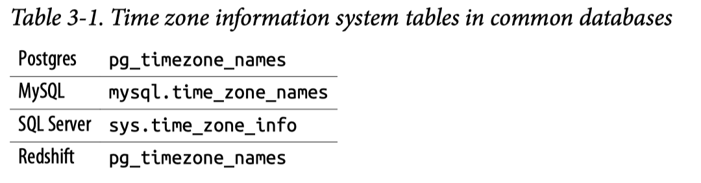

## Time Series Analysis

### Date, Datetime, and Time Manipulations

#### Time Zone Conversions

Understanding the standard time zone used in a data set can prevent misunderstandings and mistakes further into the analysis process.

Many databases are set to `Coordinated Universal Time (UTC)`, the global standard used to regulate clocks, and record events in this time zone.
The `UTC` time zone is `0` offset from Greenwich Mean Time (GMT).



#### Date and Timestamp Format Conversions
Dates and timestamps are key to time series analysis. 

To return the current date, some databases have a current_date function, with no parentheses:

```sql
SELECT current_date;
```

- There is a wider variety of functions to return the current date and time. The functions with parentheses do not take arguments, but it is important to include the parentheses:

```sql
SELECT current_timestamp;
SELECT now();
SELECT get_date();
SELECT localtimestamp;
```

- There are functions to return only the timestamp portion of the current system time.

```sql
current_time 
localtime 
timeofday()
```

- To reduce the granularity of a timestamp, use the date_trunc function. The first argument is a text value indicating the time period level to which to truncate the timestamp in the second argument. The result is a timestamp value:

```sql
date_trunc (text, timestamp)

SELECT date_trunc('month','2020-10-04 12:33:35'::timestamp);

date_trunc
## output: 2020-10-01 00:00:00 ##
```

Standard time period arguments include:
- `millisecond`
- `second`
- `minute`
- `hour`
- `day`
- `week`
- `month`
- `quarter`
- `year`
- `decade`
- `century`
- `millennium`

SQL provides a few functions for returning just the part of the date or timestamp required. Dates and timestamps are usually interchangeable, except when the request is to return a time part.

- The **date_part** function takes a text value for the part to be returned and a date or timestamp value. The returned value is a FLOAT, which is a numeric value with a decimal part; depending on your needs, you may want to cast the value to an integer data type:

```sql
SELECT date_part('day',current_timestamp); 
SELECT date_part('month',current_timestamp); 
SELECT date_part('hour',current_timestamp);
```

- Another function that works similarly is **extract**, which takes a part name and a date or timestamp value and returns a FLOAT value:

```sql
SELECT extract('day' from current_timestamp);
```

A simple way to create a timestamp from separate date and time components is to concatenate them together with a `plus sign (+)`:

```sql
SELECT date '2020-09-01' + time '03:00:00' as timestamp;

## output: 2020-09-01 03:00:00 ##
```

A date can be assembled using the `make_date`, `makedate`, `date_from_parts`, or `date fromparts` function.

```sql
SELECT make_date(2020,9,1);

## output: 2020-09-01 ##
```

Yet another way to assemble a date or timestamp is to concatenate the values together and then cast the result to a date format using one of the casting syntaxes or the `to_date` function:

```sql
SELECT to_date(concat(2020,'-',09,'-',01), 'yyyy-mm-dd');

to_date
## output: 2020-09-01 ##

SELECT cast(concat(2020,'-',09,'-',01) as date);

to_date
## output: 2020-09-01 ##
```

#### Date Math
SQL allows us to do various mathematical operations on dates. This might be surprising since, strictly speaking, dates are not numeric data types.

Date math involves two types of data: the dates themselves and intervals. Intervals come in two types: year-month intervals and day-time ones.

We’ll start with a few operations that return integer values and then move on to functions that work with or return intervals.

- First, let’s find the days elapsed between two dates. There are several ways to do this in SQL. The first way is by using a mathematical operator, the minus sign (–):

```sql
SELECT ('2020-06-30'::date - '020-05-31'::date);

SELECT date('2020-06-30') - date('2020-05-31') as days;

## output: 30 ##
```

This returns the number of days between these two dates. Note that the answer is 30 days and not 31. **The number of days is inclusive of only one of the endpoints.**

Finding the difference between two dates can also be accomplished with the `datediff` function. **Postgres does not support it, but many other popular databases do.** `datediff(interval_name, start_timestamp, end_timestamp)`

```sql
SELECT datediff('day',date('2020-05-31'), date('2020-06-30')) as days;

## output: 30 ##
```

In Postgres, this can be accomplished using the `age` function, which calculates the interval between two dates:

```sql
SELECT age(date('2020-06-30'),date('2020-01-01'));

## output: 5 mons 29 days ##
```

We can then find the number of months component of the interval with the date_part() function:

```sql
SELECT date_part('month',age('2020-06-30','2020-01-01')) as months;

## output: 5 ##
```

**To do addition with dates, we need to leverage intervals or special functions.**

For example, we can add seven days to a date by adding the interval '7 days':

```sql
SELECT date('2020-06-01') + interval '7 days' as new_date;

## output: 2020-06-08 ##
```

Many but not all databases have a `date_add` or `dateadd` function that takes the desired interval, a value, and the starting date and does the math:

```sql
SELECT date_add('month',1,'2020-06-01') as new_date;
new_date
## output: 2020-07-01 ##
```

Using date math is common in analysis with SQL, both to find the time elapsed between dates or timestamps and to calculate new dates based on an interval from a known date.

#### Time Math
Time math is less common in many areas of analysis, but it can be useful in some situations.

Time math works similarly to date math, by leveraging intervals. We can add time intervals to times:

```sql
SELECT time '05:00' + interval '3 hours' as new_time;

new_time
## output: 08:00:00 ##
```

We can also subtract times, resulting in an interval:

```sql
SELECT time '05:00' - time '03:00' as time_interval;

time_interval
## output: 02:00:00 ##
```

#### Joining Data from Different Sources

Combining data from different sources is one of the most compelling use cases for a data warehouse.

Dates and timestamps that are in different formats can be standardized with SQL. JOINing on dates or including date fields in UNIONs generally requires that the dates or timestamps be in the same format.

### PostgresSQL

**macOS (homebrew)**

```bash
# 安装 PostgreSQL
brew install postgresql

# 启动服务
brew services start postgresql

# 创建数据库（首次使用）
createdb $(whoami)

# 进入交互终端
psql
```

```bash
# 1. 先连接到默认数据库
psql -U postgres

# 2. 在 PostgreSQL 终端中创建新数据库
CREATE DATABASE "yu.pei";

# 3. 退出
\q

# 4. 重新连接
psql -U yu.pei  # 或指定数据库：psql -d yu.pei -U your_username
```

### NOTES

**What Is the PARTITION BY Clause in SQL?**

The SQL PARTITION BY expression is a subclause of the OVER clause, which is used in almost all invocations of window functions like `AVG()`, `MAX()`, and `RANK()`.

The first thing to focus on is the syntax. Here’s how to use the SQL `PARTITION BY` clause:

```sql
SELECT
    <column>,
    <window function> OVER(PARTITION BY <column> [ORDER BY <column>])
FROM table;
```

Example:


    | car_make | car_model | car_price | average_make |
    |----------|-----------|-----------|--------------|
    | Citroen  | Picasso   | 23400     | 21200        |
    | Citroen  | Cactus    | 19000     | 21200        |
    | Ford     | Galaxy    | 12400     | 13196        |
    | Ford     | Falcon    | 8990      | 13196        |
    | Ford     | Mondeo    | 18200     | 13196        |
    | Renault  | Megane    | 14300     | 15400        |
    | Renault  | Fuego     | 16500     | 15400        |


As an example, say we want to obtain the average price and the top price for each make. Use the following query:

```sql
SELECT
    car_make,
    AVG(car_price) AS average_price,
    MAX(car_price) AS max_price
FROM car_sales
GROUP BY car_make;

## output:
| car_make | average_price | max_price |
|----------|---------------|-----------|
| Citroen  | 21200         | 23400     |
| Ford     | 13196         | 18200     |
| Renault  | 15400         | 16500     |
```

You cannot do this by using GROUP BY, because the individual records of each model are collapsed due to the clause GROUP BY `car_make`.

```sql
SELECT
  car_make,
  car_model,
  car_price,
  AVG(car_price) OVER (PARTITION BY car_make) AS average_make
FROM car_list_prices;

## output:
| car_make | car_model | car_price | average_make |
|----------|-----------|-----------|--------------|
| Citroen  | Picasso   | 23400     | 21200        |
| Citroen  | Cactus    | 19000     | 21200        |
| Ford     | Galaxy    | 12400     | 13196        |
| Ford     | Falcon    | 8990      | 13196        |
| Ford     | Mondeo    | 18200     | 13196        |
| Renault  | Megane    | 14300     | 15400        |
| Renault  | Fuego     | 16500     | 15400        |

```